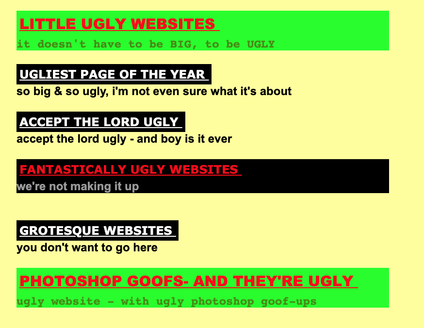
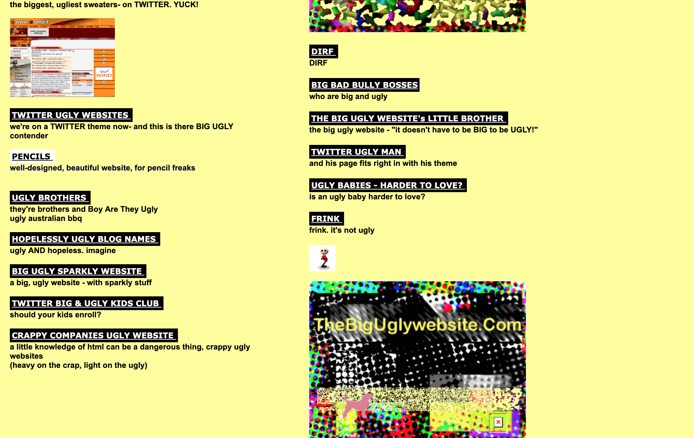

# website markdown

## 1.What website did you find (url, name,...) 
* The big ugly website
* http://thebiguglywebsite.com
 

## 2.Does it get regular updates ?
 *  The website does not recieve regular updates, there is information on it dating from 1980.

## 3.How did you find it?
---

1. You go to [google](http://www.google.com).

1. Typing  *"ugly website"*.
1. The second result will be our perfect website.

---
Let's have a look at our website! 
---

## 4.Why does this website need an update / complete makeover ?
---
1. Too messy.
1. Ugly color choice. 
Red and Green?

1. Font size is too small.

## 5. Is this website active on social media ?
  no it not!
## 6. Make a list with the top three things you would change first (and explain why those three specifically)
things to change from this website are as follows:
1. layout: the layout of a website should be attractive enough to intrigue the audience intended for.
2. styling: how the styling used in the website is important for the eyes. For an example, the clours used in this website are too bright and completely far to complement one another. Therefore, it is tiring to look at it!
3. user interface: the design doesn't comply with the web design standards.
